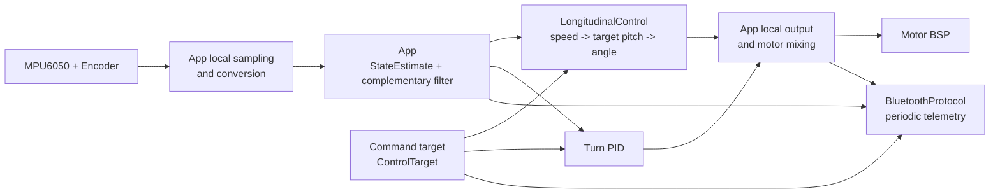

# 平衡车应用层架构

本文档对应 `App/` 目录当前建立的应用骨架。它描述模块边界、数据流和
后续实现顺序；BSP 的寄存器和外设细节仍以各自头文件注释为准。

## 1. 分层原则

```text
Core/main.c
└─ App（唯一整车状态机）
   ├─ Sensor sampling ─────── MPU6050 / Encoder BSP
   ├─ Command ─────────────── Bluetooth / Keys
   ├─ Complementary filter ── one formula in App
   ├─ LongitudinalControl ─── PID（速度外环串联角度内环）
   ├─ Turn PID ────────────── 与纵向控制并联
   ├─ BluetoothProtocol ───── BlueToothSerial BSP
   └─ Motor output ────────── Motor BSP
```

- `Core/`：CubeMX 生成的时钟和外设初始化。`main.c` 只调用
  `App_Init()`、`App_Update()`，不保存整车运行数据。
- `BSP/`：封装单个硬件，不知道整车状态、目标速度或 PID。
- `App/`：定义整车语义。模块通过结构体传数据，不互相翻找全局变量。
- `App.c`：唯一知道全部模块，负责调用顺序和状态转换。项目只有一辆车，
  因而不定义可创建的整车对象，也不在私有函数间传递 `App *`。

`App.c` 内仍用一个匿名 `static struct` 集中存放唯一一份运行数据。这只是
避免几十个文件静态变量散落的整理方式，不是多实例对象接口。

项目只有一套固定硬件和一份应用实例，因此普通模块不再机械套用
`Config → GetDefault → Init → initialized`。姿态和安全阈值直接取自
`BalanceCarConfig.h`。三个控制环各持有一个 `PID`，参数和算法历史不再拆成
`PID_Config + PID_Controller` 两层；调试命令直接修改对应PID的增益字段。

## 2. 运行数据流



共享数据定义在 `BalanceCarTypes.h`：

| 类型 | 含义 | 生产者 | 消费者 |
| --- | --- | --- | --- |
| `BalanceCar_StateEstimate` | 角度、角速度和组合轮速 | App | 控制、遥测 |
| `BalanceCar_ControlTarget` | 目标速度、转向和零点修正 | Command | 控制器 |

`BalanceCarTypes.h` 只保留确实跨文件交换的数据。仅App使用的整车状态枚举已
移回 `App.c`；原来的“控制环枚举 + Kp/Ki/Kd枚举”合并为九项
`BalanceCar_PIDParameter`；行为相同的RECOVER内部命令并入START；从未被
完整消费的 `BalanceCar_ControlOutput` 也已删除。目标倾角直接保存在纵向
控制器中，转向输出由App跨周期保存，平衡输出和左右电机命令只用局部变量。
状态估计与控制目标方向不同，仍分别保留，避免把测量值和设定值混进一个
万能结构。

## 3. 模块职责

### App

负责：

- 绑定实际底板上的定时器、GPIO、I2C和UART；
- 在实现文件内部集中持有唯一一份BSP实例和运行数据；
- 管理 `CALIBRATING → BALANCING` 以及 `FALLEN/FAULT` 状态；
- 直接完成一次MPU/编码器采样并更新 `StateEstimate`；
- 轮询输入并把统一命令交给Command，按固定周期触发诊断输出；
- 按固定周期调度采样和控制；
- 倾角越界时只切换到 `FALLEN`，停机由 `FALLEN` 状态分支负责。

对外只提供 `App_Init(void)` 和 `App_Update(void)` 两个入口。状态转换、命令
应用、调度时间戳和硬件能力标志均为本文件私有。私有函数直接访问唯一的
文件静态数据，不机械传递 `App *`，也不为不存在的第二辆车预留生命周期。

电机、编码器和IMU是核心硬件，初始化失败会进入 `FAULT`。蓝牙是可选
交互外设，初始化失败只关闭调参与遥测，不阻止姿态控制运行。

不负责：具体PID公式和蓝牙字符串解析。

### App 内部采样

项目只有一组 MPU 和左右编码器，不再额外创建 `CarSensors` 对象。采样作为
`App.c` 内部步骤，负责：

- 一次性读取 MPU6050 和左右编码器；
- 用局部变量完成加速度角、角速度和编码器组合速度换算；
- 根据相邻调度时刻计算真实 `dt`，直接用于互补滤波和控制器；
- 更新精简后的 `StateEstimate`。

MPU原始值和编码器增量只在一次更新中临时存在，不再保存完整三轴副本、
温度或第二层 `SensorFrame`。控制和遥测只读取精简后的状态估计，因此仍
不会直接依赖BSP。MPU读取失败时App直接进入 `FAULT`。

### App内互补滤波

负责：

- 校准时只在线平均会随上电和温度变化的陀螺仪零偏；
- 加速度角使用固定安装偏置，不把每次手扶姿态重新定义为零点；
- 运行时计算去偏角速度和固定安装修正后的绝对加速度角；
- 直接用一行互补滤波公式更新 `state_estimate.pitch_deg`。

静止采样、俯仰轴陀螺仪零偏和校准成功/失败由整车 `CALIBRATING` 状态直接
管理。互补滤波没有独立状态、对象或函数文件；它只是5ms采样流程中的一次
数值计算，上一帧历史直接保存在 `state_estimate.pitch_deg`。

陀螺仪零偏使用在线平均更新，因此App只保存当前平均值和样本数，不再同时
保存累计和与最终均值两份浮点状态。

校准是否静止由操作者保证，不再用单个角速度阈值尝试自动判定。该阈值只能
排除明显转动，既不能证明车体真正静止，也可能把振动误判为移动。上电校准
完成后会直接进入平衡，因此校准期间必须扶稳车体；扶持角度不再参与零点
定义。固定安装偏置只在机械结构变化后重新测量并修改。

传感器在车体上的轴向和正负号必须通过实物动作确认，不能靠 PID 参数
修正接反的符号。

### PID

只实现通用单路控制器：

- 一个 `PID` 同时保存增益、限幅、积分与上一误差；
- `PID_Update()` 由调用者传入 `dt`，不读取 HAL 时钟；
- `PID_Reset()` 在开始重新校准时清除上一轮控制历史。

项目固定只有平衡、速度和转向三个PID，不再复制配置对象，也不提供
`SetConfig/SetTunings`。调试阶段直接修改目标PID的 `kp/ki/kd`；参数稳定后
它们仍是同一份运行时字段，不需要再搬运或冻结。

当前位置式PID已经实现首帧无微分、I项输出积分、积分限幅、最终输出限幅和
条件积分 anti-windup。输出饱和时只拒绝继续推向饱和方向的积分增量，反向
误差仍可立即释放已有积分。电机死区补偿不再属于PID：死区跟随单个轮子的
转向，因此由App在差分混合出左右轮命令之后按每轮符号叠加，并在
`OffsetBand` 过渡带内线性给出，避免公共输出过零时±Offset硬跳变产生的
高频抖振极限环（7-22日志实测静止时电机命令以约5Hz在±48间翻转）。
角度内环直接在 `LongitudinalControl_UpdateAngle()` 中使用陀螺仪角速度作为
D项，避免目标倾角变化产生微分冲击；不再为复用少量公式增加第二套PID入口
和内部 `PID_Apply()` 转发层。

### LongitudinalControl

它封装的是整辆车的纵向闭环能力，而不是三个算法的容器：

- `speed_pid` 根据整车速度误差生成相对平衡零点的小倾角修正；
- `AngleControl` 追踪该目标倾角，生成左右轮共同使用的控制量；
- 目标倾角保存在纵向控制器中，在两次低频速度环更新之间保持。

实车平衡零点由 `BalanceTrim` 给出，目前实车标定值是 `1.6°`。最终目标为
`BalanceTrim + speed_pitch_delta`，并受整车目标倾角边界限制；这样启用速度环
时不会把已经验证的静态工作点替换成0°，也不会因为编码器瞬时异常给出
危险目标倾角。

因此速度环和角度环明确组成串级关系。调用者不再手工搬运“外环输出”，只需
分别在50 Hz和200 Hz时刻更新纵向控制器。它只返回共同控制量，不知道左右
电机、转向差分和BSP。

转向环目前作为App中的独立PID，与纵向控制并联。App在 `BALANCING` 状态内
直接计算：

```text
left  = balance_output - turn_output
right = balance_output + turn_output
```

转向PID自身先限制在电机量程的30%，混合前还会按
`motor_limit - abs(balance_output)` 再限制一次差分量，避免某一侧电机先饱和
后把纯转向变成纵向运动。零转向目标且GZ进入 `±1 deg/s` 噪声带时会清除
转向PID历史，防止零偏或积分残留造成持续爬行。随后才交给Motor BSP；不为
这几行关系建立 `MotorMixer` 模块。三个PID参数仍只有一份；Command分别定位
纵向控制器中的速度/角度PID和App持有的转向PID。

### App内安全处理

安全逻辑不再单独建模块或故障位集合。MPU读取失败直接进入 `FAULT`，倾角
超过阈值直接进入 `FALLEN`，电机写入失败直接进入 `FAULT`。状态转换处只
决定下一状态；`CALIBRATING`、`FALLEN` 和 `FAULT` 各自在自己的 `case` 中
持续执行停机动作。这样状态变量不再只是标签，主状态机本身就是动作的
唯一落点。控制器负责生成限幅命令，Motor BSP仍保留最终的
`-1000..1000`硬限幅。主循环整体卡死以后再交给独立硬件IWDG处理。

### Command

Command保留独立 `.c/.h` 文件，但不再制造 `CommandHandler` 对象。模块没有
初始化、生命周期或私有状态，只提供一个 `Command_Apply()`：

- 数值命令直接写入App持有的 `ControlTarget`；
- 九个PID参数由单一参数枚举索引，通过PID指针表和增益字段表定位；
- START/STOP只返回简短动作，状态合法性和电机停机仍由App决定；
- 运动目标更新时间由App保存，用于超时后把速度和转向目标归零。

实体按键的GPIO、引脚和完整 `BalanceCar_Command` 结构体集中在 `App.c` 的
静态绑定表中，初始化与扫描共用同一份数据；当前映射为K1=START、K2=STOP、
K3=START、K4=NONE。蓝牙的外部 `Recover` 帧也映射成内部START，因此不再
保留两个行为完全相同的命令枚举。

状态合法性和重新校准准备仍由命令分支处理，电机动作只写在相应App状态
分支中，不增加通用的“进入状态”函数。这样Command负责命令语义，App负责
整车状态，既没有Handler空壳，也没有把协议和参数查表全部塞回App。

### BluetoothProtocol

位于字节流BSP和领域命令之间：

- 非阻塞消费DMA环形缓冲区中的现有字节；
- 按原教程的 `[...]` 包头包尾组装一条命令，不依赖换行；
- 处理行过长和RX溢出；
- 解析九个PID滑杆、角度环输出补偿及 START/STOP/RECOVER；
- 每到遥测周期，直接把当前状态、估计、目标和输出格式化后交给DMA发送。

应用不再永久保存一份全量遥测镜像，也不再同时维护“周期发送”和“请求
发送”两套触发方式。当前只保留固定周期发送。

协议兼容层已经启用。九个PID滑杆沿用 `AngleKp..TurnKd`；`Offset` 表示
按轮死区补偿幅值，`OffsetBand` 表示其线性过渡带宽；本项目额外用
`BalanceTrim` 表示目标平衡角修正，避免混淆两个物理量。曲线回传使用
`[plot,...]`。`[joystick,LH,LV,RH,RV]` 将LV和RH在同一条命令中分别映射为
目标前进速度与目标偏航角速度；运动命令超时后两项目标同时归零。完整帧格式
见 [蓝牙调参协议](BluetoothProtocol.md)。

USART2 已占用 DMA1 Channel 6/7，而 I2C1 也映射到同一对 DMA 通道。因此
OLED现在直接显示三环PID、Offset、BalanceTrim、姿态、电机命令、整车状态
和合法蓝牙帧计数。I2C1提升到400 kHz，并把128×64显存拆成8页，每20 ms
只同步发送一页；完整画面约160 ms更新一次。这样既不占用与USART2冲突的
DMA1 Channel 6/7，也避免一次完整1 KB刷新长时间阻塞200 Hz控制环。显示是
App中的一个直接周期任务，不再建立独立 `AppDisplay` 对象。

## 4. 状态机

整车只保留这一层状态机。蓝牙、按键、校准和安全检测产生的是输入或判断
结果，它们直接请求状态转换，不再先包装成第二套通用事件枚举。

| 当前状态 | 输入或判断结果 | 下一状态 | 电机处理 |
| --- | --- | --- | --- |
| 初始化 | 成功 / 失败 | CALIBRATING / FAULT | 强制为零 |
| CALIBRATING | 校准成功 | BALANCING | 开始闭环输出 |
| CALIBRATING | 校准失败 | FAULT | 强制为零 |
| BALANCING | STOP命令 | FALLEN | FALLEN分支持续清零电机 |
| BALANCING | 检测到跌倒 | FALLEN | FALLEN分支持续清零电机 |
| FALLEN | START/RECOVER命令 | CALIBRATING | 重新校准并自动恢复平衡 |
| 正常状态 | 检测到致命故障 | FAULT | FAULT分支持续清零电机 |

`FAULT` 不接受软件恢复命令，避免硬件故障未经检查直接重新启动；当前设计
要求复位整机后重新初始化。

这里采用最直接的 Moore 状态机写法：输入和检测只修改 `state`，每个
`case` 根据当前状态执行动作。`CALIBRATING`、`FALLEN`、`FAULT` 都会在每次
主循环调度时再次写入零电机命令，`BALANCING` 才允许运行闭环并输出PWM。

## 5. 初始任务周期

| 周期 | 任务 | 说明 |
| --- | --- | --- |
| 1 ms | HAL毫秒时基 | SysTick中断递增，App通过`HAL_GetTick()`读取 |
| 5 ms | 传感器、姿态、平衡内环、安全、电机 | 200 Hz |
| 20 ms | 速度外环、转向环 | 50 Hz |
| 10 ms | 按键扫描 | 非阻塞消抖 |
| 5 ms或主循环空闲 | 蓝牙协议轮询 | 只处理已经收到的字节 |
| 50 ms | 蓝牙遥测 | 串口忙则跳过或等待下次 |

当前周期与硬件已经做过第一轮静态匹配：

- MPU6050启用DLPF（配置3，陀螺仪带宽约42 Hz）后内部输出率为1 kHz，
  `SMPLRT_DIV=4`得到200 Hz新样本，与5 ms姿态环一一对应；
- MPU所在I2C2使用400 kHz，连续读取14字节约占不到0.5 ms，为5 ms控制周期
  留出充足余量；运行时I2C超时限制为5 ms，通信故障不会阻塞100 ms；
- TIM2时钟72 MHz、ARR=3599，电机PWM为20 kHz；
- 编码器虽然每5 ms消费一次硬件增量，但累计满20 ms后才换算速度，避免
  低速时一个计数被换算成200 counts/s的严重量化跳变；
- 互补滤波直接配置1秒时间常数，再根据本次真实 `dt` 计算陀螺仪权重；
  5 ms周期时权重约为0.995，偶发周期抖动不会改变滤波器的物理时间尺度。

在实板、72 MHz、I2C2=400 kHz、蓝牙遥测开启且PID增益为零的条件下，曾用
Cortex-M3 DWT连续测量4216个控制周期：周期最小/最大均为5 ms，单次完整
采样、滤波、控制和电机写入的最坏执行时间为40080周期，即约0.557 ms，只占
5 ms预算的11.1%。测量插桩随后已删除，正式固件不保留调试状态。

这些数值是首轮调试起点，不是控制效果的最终结论。TIM1虽然已配置为1 ms
更新周期，但当前没有启动；第一版先用 `HAL_GetTick()` 做协作式调度。若实测
控制周期抖动明显，再让TIM1只置到期标志，I2C和PID仍留在主循环执行。

## 6. 当前首次上车前状态

当前程序已经接通采样和安全数据流，但尚不能平衡：

- 上电完成核心BSP和内部模块初始化，可选外设失败时降级运行；
- 应用进入 `CALIBRATING`；
- LED每250 ms翻转；
- 校准只在线平均陀螺仪零偏，加速度角使用固定安装偏置；
- 完成500个样本后自动进入 `BALANCING`，上电时必须扶稳车体；
- `BALANCING` 已完成5ms MPU采样、20ms编码器速度窗口、互补滤波和5/20ms控制调度；
- 安全检查和Motor BSP输出路径已接通；
- 角度环已写入实车调试初值，速度环和转向环默认增益为零；
- 蓝牙已支持教程方括号调参帧和非阻塞曲线回传；
- OLED显示三环参数、状态和蓝牙合法帧计数，并采用分页刷新；
- TIM1调度尚未启动。

当前会进入完整电机输出路径，并在校准完成后使用角度环参数和平衡零点；
`BALANCING` 状态暂时停止OLED刷新，排除阻塞I2C发送造成的控制周期抖动。
更改控制方向或大幅提高增益后，仍必须先架空车轮验证闭环方向再落地。

## 7. 推荐实现顺序

1. 通过调试器或蓝牙曲线验证角度、角速度和编码器速度的单位与正负号。
2. 只观察互补滤波角度，不启用非零PID参数。
3. 用调试器测量5/20ms协作式任务的实际周期和最坏执行时间；需要时再启用
   TIM1节拍。
4. 只给角度环设置非零P，架空或手持验证电机追赶方向。
5. 依次调好角度环P、D，再加入速度环，最后加入转向环。
6. 实车复核摇杆方向与最大速度/偏航角速度，并按需要微调缩放。
